<div align="center">


# Homewarp

**Run game servers on your own computer at home.**<br>
**Friends join from anywhere, and your home address stays private.**

[](https://github.com/lanceranara13/homewarp/releases)
[](LICENSE)


[](https://ko-fi.com/pixelsthecoder)

[What it is](#what-is-homewarp) ·
[How it works](#how-it-works) ·
[See it](#see-it) ·
[Get started](#get-started) ·
[Everyday tasks](#everyday-tasks) ·
[FAQ](#faq)

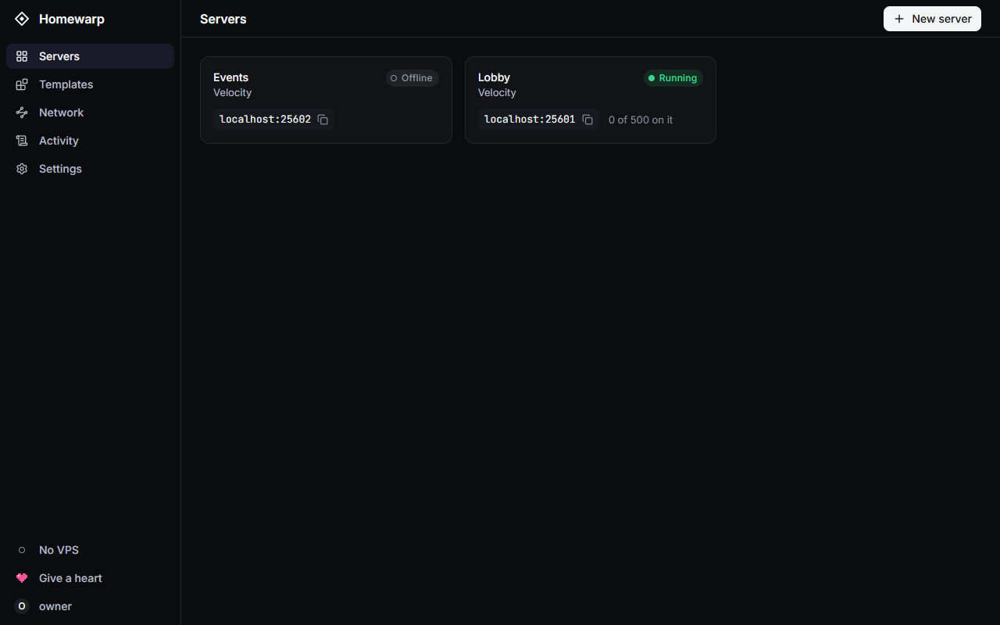

</div>

> **Status: early.** Everything described here is built and has been tried on
> real machines. Expect rough edges.

## What is Homewarp?

Homewarp is a free program that turns a computer at home into a place to run
game servers: Minecraft, Valheim, Terraria, Palworld and hundreds more. You
look after all of them from one web page, with buttons instead of typed
commands.

Hosting at home has one hard part: letting friends in. Normally you would have
to change settings on your router and hand out your home address. Homewarp
does it another way. A small, cheap rented server stands in front of your
home as a front door. Friends connect to the front door, and it passes them
along a private tunnel to your computer.

- 🏠 **Your games stay on your computer.** Worlds, files and backups never
  leave home.
- 🔗 **Friends join with one address.** They type it into the game, as they
  would for any other server.
- 🙈 **Your home stays hidden.** Nothing to set up on your router, and your
  home address is never given out.
- 🎮 **Hundreds of games.** Pick one from a list and Homewarp installs it.
- 💜 **Free and open source.** No subscription, no licence codes, nothing
  locked.

## How it works

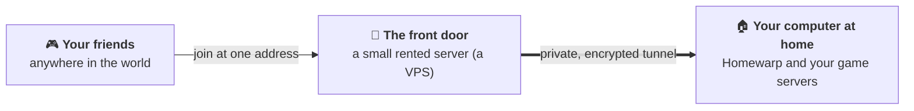

| Part | What it does |
|---|---|
| **Your computer at home** | Runs Homewarp and every game server. It keeps all the worlds, files and backups. |
| **The front door** (a VPS) | Passes players through and stores nothing, so the cheapest plan is enough: 1 CPU and 512 MB of memory. If you ever change it for another, that takes one command. |
| **The tunnel** | A private, encrypted link between the two. Your home computer opens it, which is why your router needs no changes. |

Good to know:

- **The front door is optional.** Without one, your servers work for anyone on
  your home network, such as family on the same Wi-Fi.
- **It works on awkward connections.** Some internet providers do not give a
  home its own public address (this is called CGNAT). Homewarp works there
  too, because home is the side that reaches out.
- **Servers still see who is who.** A server sees each player's real address,
  so bans and limits work as they would on a rented host.

### Words used on this page

| Word | What it means |
|---|---|
| **Game server** | The program your friends connect to, so that you all play in the same world. |
| **Panel** | Homewarp's web page, where you control everything. |
| **VPS** | A small computer you rent on the internet by the month. Homewarp uses it only as a front door. |
| **Docker** | A free program that runs each game server in a sealed box of its own (a "container"), so one server cannot disturb another, or the rest of your computer. |
| **Template** (or "egg") | A recipe that tells Homewarp how to install and start one game. The communities around the Pterodactyl and Pelican panels share hundreds of them, and call them eggs. |
| **Port** | The number after the colon in an address, as in `example.com:25565`. Every server has its own. |
| **Backup** | A saved copy of a server's files, which you can put back later. |

## See it

*The pictures on this page are of a demonstration setup. The servers in them
are examples.*

| | |
|---|---|
| 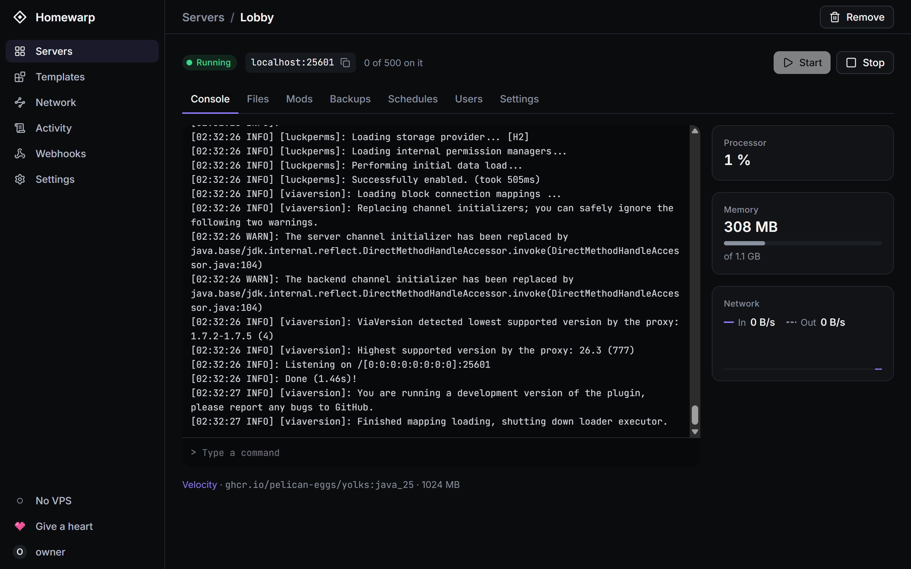 **A live console.** Read what the server says, type commands, and see how much of the computer it uses. | 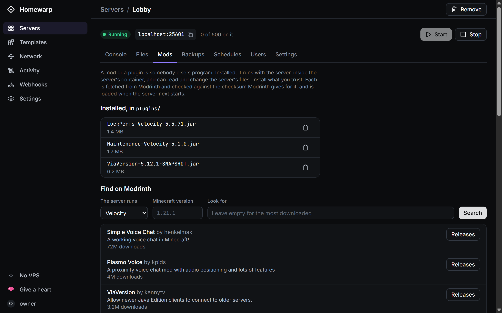 **Mods and plugins.** For Minecraft, search Modrinth and install with one button. |
| 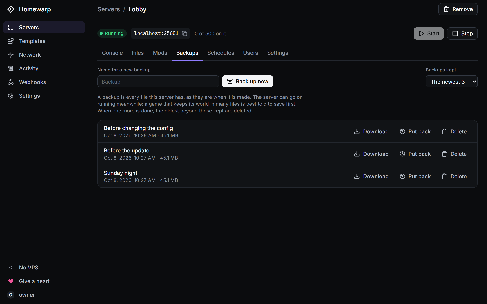 **Backups.** Make one with a button, and put one back the same way. | 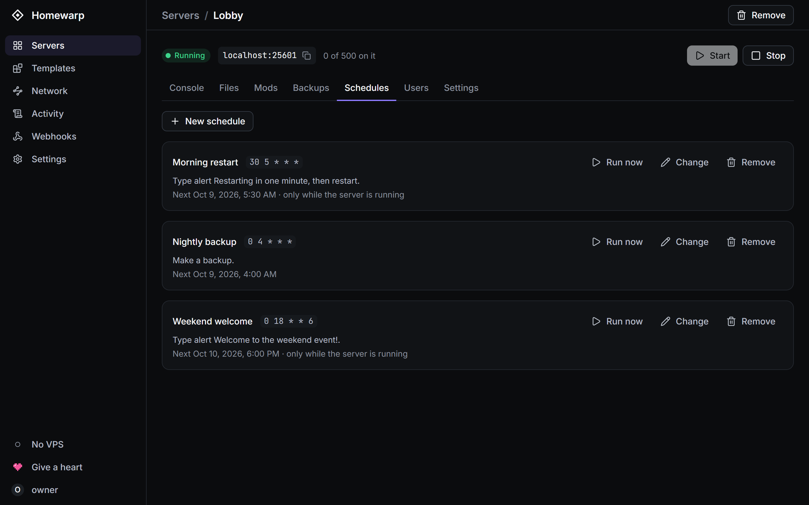 **Schedules.** Back up every night, or restart every morning, by the clock. |
| 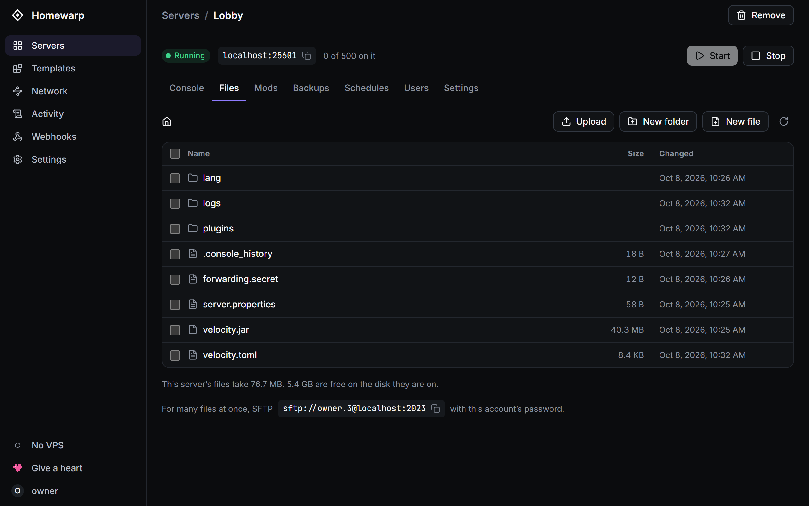 **Files.** Edit, upload and download a server's files in the browser. | 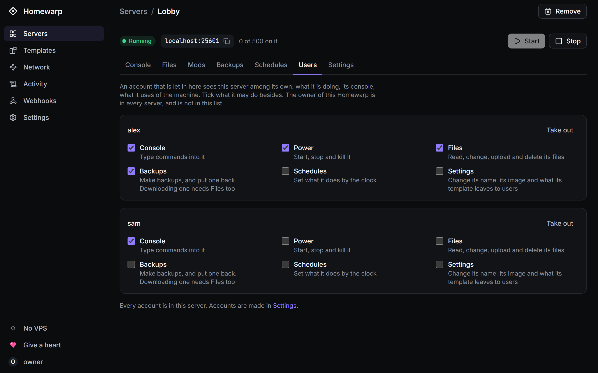 **Sharing.** Give a friend an account, and tick what they may do with a server. |
| 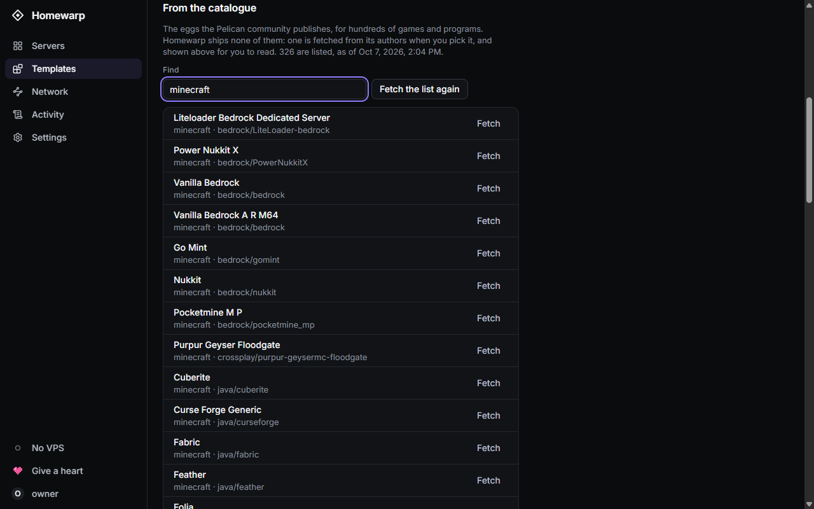 **A catalogue of games.** Hundreds of templates, fetched when you pick one. | 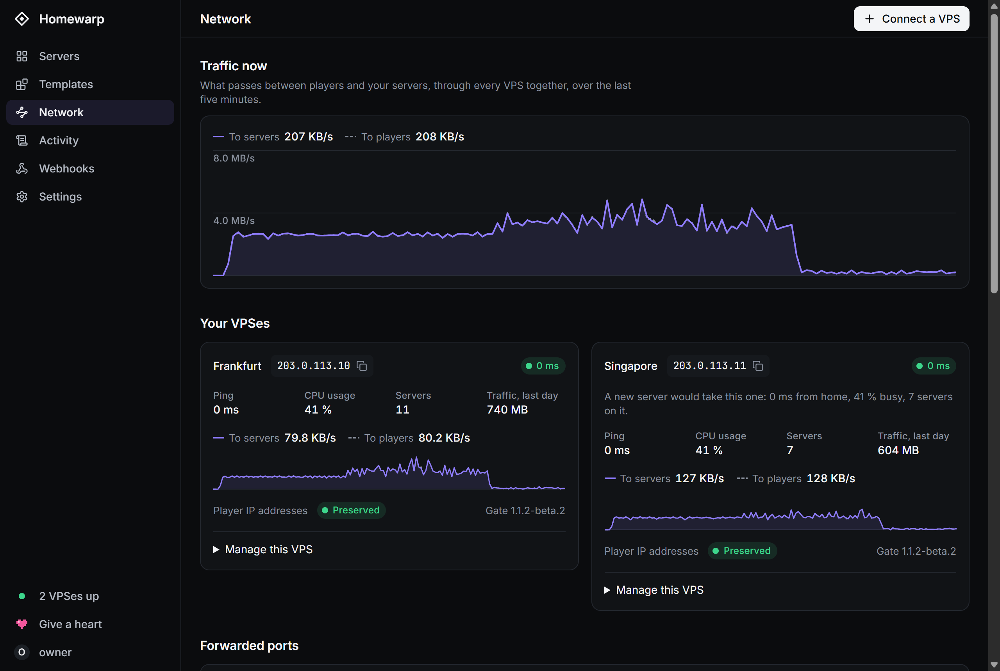 **The Network page.** Your front doors, and what passes through them. |

## What it does

- **Runs game servers.** Install, start, stop and restart with a button. A
  server that crashes is started again by itself.
- **Keeps your worlds safe.** Backups by hand or by the clock, and a copy of
  each one stored somewhere else if you want, so a broken disk is not a lost
  world.
- **Rests when nobody is playing.** An empty Minecraft server can be put to
  sleep, and it wakes when the first player joins.
- **Lets you share the work.** Give friends their own accounts, each allowed
  into the servers you choose, for the things you choose.
- **Tells you when something happens.** A message in Discord or Slack when a
  server crashes or a front door stops answering.
- **Keeps itself up to date.** Updates are installed from the panel.

<details>
<summary><b>The full list, in detail</b></summary>

<br>

**Servers**
- Install, start, stop and restart servers from a template, each in its own
  locked-down container: not root, no capabilities, read-only root, memory and
  process limits, and kept from your home network.
- A live console to read and type into, with processor and memory use.
- An icon for each server, from any picture you choose, to tell them apart at
  a glance.
- Started again after a crash, a little later each time, and left alone after
  four in a row.
- Files in the browser and over SFTP: edit, upload, download, pack and unpack.
- Backups made by hand or by the clock, kept to a number you choose, and put
  back with one button.
- Schedules: commands, restarts and backups at times you set.

**Templates**
- Import an egg from a file, pasted text, or its address.
- A catalogue of the eggs the Pelican community publishes. Homewarp ships none
  of them: one is fetched from its authors when you pick it, and shown to you
  before it is imported.

**Minecraft (Java Edition)**
- Who is on a server, on its page and in the list.
- Sleep: a server nobody has been on for a while is stopped, and the first
  player to join wakes it.
- A stopped server can tell players that it is offline.
- Mods and plugins from Modrinth, each checked against the checksum Modrinth
  gives before it is written.
- The DNS records that let players join by a name with no port after it.

**Through the VPS**
- Connected with one command, which carries a token that works once.
- The tunnel is put back by itself after a reboot at either end.
- A limit on new connections from one address, dropped at the VPS.
- "Harden this VPS": shuts what is not listening, on trial for a minute and
  undone by itself unless you keep it.
- Works with a VPS that runs ufw or firewalld.
- More than one VPS, each with a tunnel of its own. Each server is reached
  through the one you choose for it, and Homewarp says which it would pick:
  the nearest to home that is not busy.
- What passes through each tunnel, drawn as it happens, and what goes to and
  from each server beside its console.

**The panel**
- More accounts, each let into chosen servers for chosen things.
- Two-step sign-in and passkeys, and limits on wrong tries.
- An Activity page of who did what.
- Reachable from anywhere by a name of your own, over TLS that ends at home:
  the VPS passes it on and cannot read it. The certificate is asked for and
  renewed by Homewarp.
- Webhooks: a Discord or Slack channel told when something happens while you
  are away (a crash, a server asleep or woken, a VPS that stopped answering),
  as many as you like, each told of what you choose.
- A copy of every backup in a bucket elsewhere (Amazon S3, Cloudflare R2,
  Backblaze B2, MinIO), so a lost disk is not a lost world.
- Updates from the panel: it looks for a newer release, checks it against the
  key releases are signed with, and puts it in place of itself. Every server
  can be backed up first, and a version that does not start is put back.
  Betas for those who ask for them.

</details>

## What you need

| | What | Notes |
|---|---|---|
| 🏠 **A computer at home** | Linux on x86-64 or ARM64, with Docker and its Compose plugin, `curl` and `openssl` 3. | It stays on while your servers run. |
| 🚪 **A VPS** (optional) | Any small Linux VPS with a public IPv4 address, `nft` (the package `nftables`), `curl` and `openssl` 3. | Only for letting friends in from the internet. You need to be root on it for one command. |
| 🌐 **A domain name** (optional) | A name of your own, such as `example.com`. | Only to open the panel from the internet by name, or to give servers names of their own. |

## Get started

### Step 1. Install Homewarp at home

On the computer at home, open a terminal and paste this one line:

```sh
curl -fsSL https://lanceranara13.github.io/homewarp/install.sh | sudo sh
```

It asks a few questions, and pressing Enter each time keeps the suggested
answer. Then it downloads Homewarp, checks that the download is genuine, and
starts it. When it is done it prints two things to keep:

- the **panel's address**, which is `http://<your computer>:3600` unless you
  chose another port, and
- a **setup code**.

Everything the installer asks, what you can change, and how to remove Homewarp
again are in [docs/installing.md](docs/installing.md).

### Step 2. Create your account

Open the panel's address in a web browser. Type the setup code, then choose a
username and a password. This first account is the owner of everything.

Lost the code? `docker logs homewarp` shows it again.

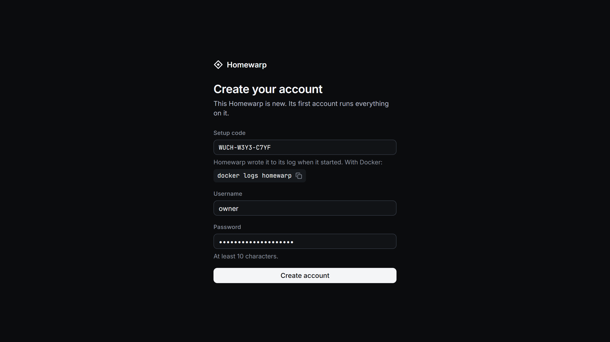

### Step 3. Pick a game

Choose **New server**. The first time, the list is empty: choose **Find a
game**, fetch the catalogue, and pick the game you want. Homewarp shows you
the template before you import it. After that the game is in your list.

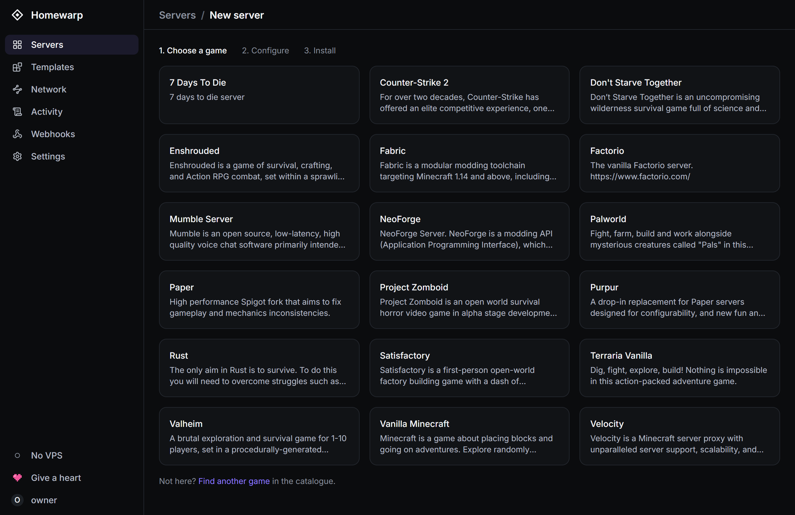

### Step 4. Name it and create it

Give the server a name, how much memory it may use, and a port. If you are not
sure, the suggested values are a good start. A game with a licence of its own
to agree to, such as Minecraft, asks you to tick a box here.

Then choose **Create server**.

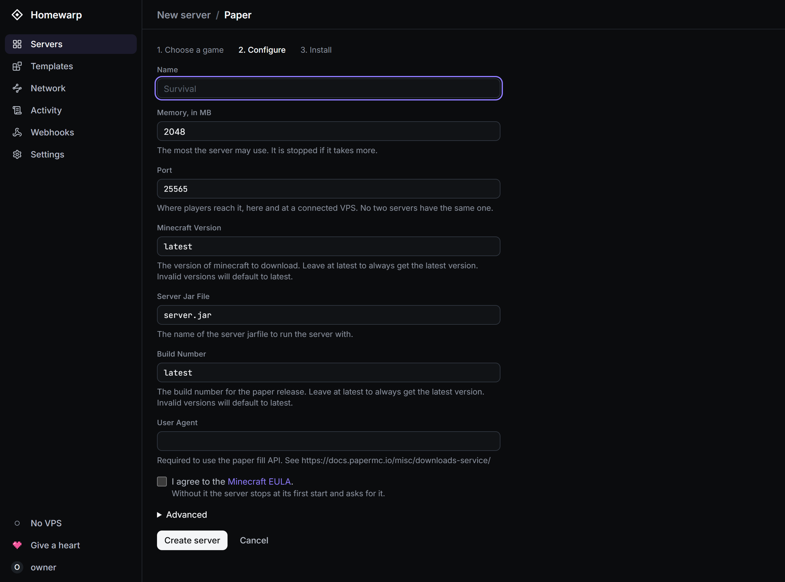

### Step 5. Watch it start

The console shows the game being installed, and then starting. When the label
turns to **Running**, the server is ready. Its address is beside its name:
people on your home network can join with it straight away.


> **Tip.** Some games write their own settings file the first time they start.
> If the console says a file "is left for the server to make", stop the server
> and start it once more.

### Step 6. Let friends in from the internet (optional)

This is where the front door comes in. You need a VPS for it.

1. In the panel, open **Network** and choose **Connect a VPS**. Type the VPS's
   public address.
2. The panel shows one command. Copy it, and run it on the VPS as root. It
   installs Homewarp's small helper there (called the Gate), opens what the
   VPS's own firewall needs, and connects the tunnel.
3. Within a few seconds the panel shows the VPS as connected, and every
   server's address changes to the VPS's. That is the address to give your
   friends.

| | |
|---|---|
| 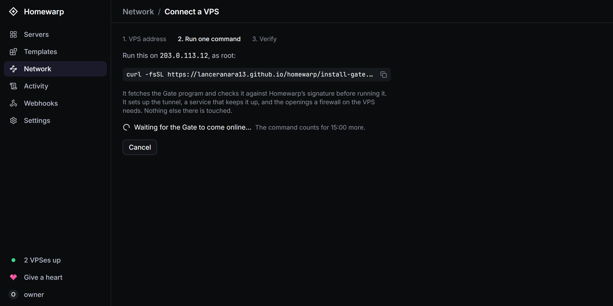 **The one command**, ready to copy. |  **Connected.** Here, two front doors in two places. |

<details>
<summary><b>More than one VPS, opening the panel from outside, and taking a VPS away</b></summary>

<br>

- **More than one VPS.** A second is connected the same way, and a third.
  Which one a server is reached through is chosen on the server's own form.
- **The panel from outside.** Point a name at the VPS, and give that name to
  the panel on the Network page. If the VPS has a firewall and no web server,
  open port 80 on it first; the panel says so if it finds it shut.
- **Taking a VPS away.** Run `homewarp-gate leave` on the VPS, as root.

</details>

## Everyday tasks

| To | Go to |
|---|---|
| Put a server to sleep when it is empty | the server's **Settings**, under Advanced |
| Add mods or plugins | the server's **Mods** tab |
| Back up now, or choose how many backups are kept | the server's **Backups** tab |
| Back up every night | the server's **Schedules** tab |
| Let a friend manage one server | the server's **Users** tab |
| Keep a copy of backups somewhere else | **Settings**, *A store elsewhere for backups* |
| Be told when a server crashes | **Webhooks** |
| Turn on two-step sign-in, or add a passkey | **Settings** |
| Update Homewarp | **Settings** |

Moving a server over from Pterodactyl or Pelican, and getting one back from a
copy after a lost disk, are in [docs/moving.md](docs/moving.md).

## Is it safe?

A game server is somebody else's program running on your computer, so Homewarp
is built on the assumption that one of them may be taken over one day.

- **Each server is sealed in.** It cannot reach your router, your other
  devices or the panel.
- **The front door knows very little.** It can reach the game ports and
  nothing else at home. It holds no worlds and no passwords.
- **Downloads are checked.** What Homewarp installs, itself included, is
  checked before it is used.

<details>
<summary><b>The same, in technical terms</b></summary>

<br>

- Servers run without root, without capabilities, on a read-only root, with
  limits, and are blocked from every private network range: a taken-over
  server cannot reach your router, your NAS or the panel.
- The VPS can reach the forwarded ports and nothing else at home. A VPS that
  is taken over learns no world, no password and no key that matters after the
  next key change.
- An egg's scripts run inside containers, and what is fetched from the
  internet is held to public `https` addresses and checked before use.
- Releases are signed, and the installers check the signature before running
  anything.

The whole model, held against the code as built, is in
[PLAN.md](PLAN.md#6-security-model).

</details>

If you find a hole, please open an issue.

## FAQ

<details>
<summary><b>Do I have to rent a VPS?</b></summary>

No. Without one, Homewarp still runs your servers, and anyone on your home
network can join them. The VPS is only for letting in friends who are
somewhere else.

</details>

<details>
<summary><b>What does it cost?</b></summary>

Homewarp is free. You pay for the electricity your home computer uses, and
for the VPS if you rent one.

</details>

<details>
<summary><b>Which games work?</b></summary>

Any game that has a template. The catalogue lists hundreds, from Minecraft and
Terraria to Valheim, Palworld and Factorio. Minecraft (Java Edition) gets a
few extras: who is playing, sleep when empty, and mods and plugins.

</details>

<details>
<summary><b>Will my friends see my home address?</b></summary>

No. They see the VPS's address and nothing else.

</details>

<details>
<summary><b>Do I have to change anything on my router?</b></summary>

No. The tunnel is opened from home, so there is nothing to forward.

</details>

<details>
<summary><b>What if the VPS breaks, or I want a different one?</b></summary>

Nothing is lost, because the VPS stores nothing. Connect a new one with one
command, as in step 6.

</details>

<details>
<summary><b>Can I use a Windows PC or a Mac at home?</b></summary>

The computer that runs Homewarp needs Linux. Your friends can play from
whatever their game runs on.

</details>

<details>
<summary><b>I already use Pterodactyl or Pelican. Can I move over?</b></summary>

Yes. Homewarp reads the same templates, and
[docs/moving.md](docs/moving.md) explains how to bring a server across.

</details>

## What is not built

- Many Minecraft servers behind one port by hostname. The DNS records the
  panel shows give each server a name without it.
- An importer that reads another panel's database
  ([docs/moving.md](docs/moving.md) has the way by hand).
- More than one home machine.
- Bedrock Edition for the Minecraft extras: players, sleep and mods are Java
  Edition only. Bedrock servers themselves run like any other game.

## Building from source

<details>
<summary><b>For developers</b></summary>

<br>

Homewarp is a Rust workspace with a React web interface that is compiled into
the program.

| | |
|---|---|
| `crates/homewarp-core` | The panel and its API, at home. |
| `crates/homewarp-gate` | The program on the VPS. |
| `crates/homewarp-runtime` | Docker, and a server's files. |
| `crates/homewarp-net` | The tunnel and firewall rules. |
| `crates/homewarp-template` | Eggs and config-file patching. |
| `crates/homewarp-proto` | What the two ends say to each other. |
| `web/` | The interface: React, TanStack, Tailwind. |
| `lab/` | A VPS, an internet and a home in containers, for testing the tunnel. |

The interface is built first, because the panel carries it inside:

```sh
cd web && npm install && npm run build && cd ..
cargo build --release -p homewarp-core -p homewarp-gate
cargo test --workspace
```

`scripts/dev.sh` does the same in containers on a second machine, along with
the lab and release builds; it is written around its author's own setup and is
worth reading before use. How a release is put together and signed is in
[docs/releasing.md](docs/releasing.md). The plan, with a record of what was
built and how each part was tried, is [PLAN.md](PLAN.md); the interface's
design is [DESIGN.md](DESIGN.md).

</details>

## Support

<a href="https://ko-fi.com/pixelsthecoder"></a> **[Give Homewarp a heart on Ko-fi](https://ko-fi.com/pixelsthecoder).**

Homewarp is free and stays free: no licence codes, no subscription, nothing
locked. If it saves you a hosting bill, a donation keeps it going.

## Licence

[GNU Affero General Public License v3.0 or later](LICENSE). You may use,
change and share Homewarp freely. If you change it and offer it to others,
including as a hosted service, you share your changes under the same licence.
